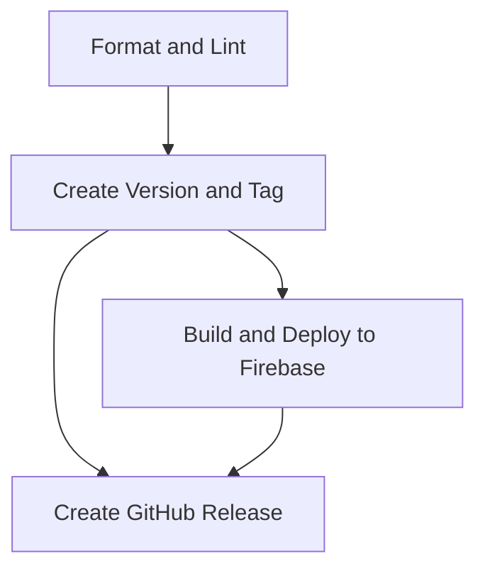

# GitHub Actions Workflows

This directory contains the automated CI/CD pipeline for continuous integration, versioning, releases, and deployment.

## CI/CD Pipeline Overview

### Single Unified Workflow (`ci-cd.yml`)

**Trigger**: Push to `main` branch

**Pipeline Flow**:

```
Push to main
    │
    ├── Job 1: Format and Lint Checks
    │   ├── Check code formatting (Prettier)
    │   └── Run linter (ESLint)
    │   └── ✅ Must pass before continuing
    │
    ├── Job 2: Create Version and Tag
    │   ├── Analyze commit message
    │   ├── Calculate new version (v1.0.0 → v1.0.1)
    │   ├── Update package.json
    │   ├── Create Git tag
    │   └── Push tag to GitHub
    │   └── ✅ Tag created
    │
    ├── Job 3: Build and Deploy to Firebase
    │   ├── Checkout code at new tag
    │   ├── Build project
    │   └── Deploy to Firebase Hosting with tag message
    │   └── ✅ Live on Firebase
    │
    └── Job 4: Create GitHub Release
        ├── Build project for archives
        ├── Create source archive
        ├── Create build archive
        ├── Generate checksums
        ├── Generate release notes
        └── Publish GitHub Release
        └── ✅ Release published
```

### Job Dependencies



Jobs run in strict sequence to ensure:
1. Code quality is verified first
2. Version tag is created before deployment
3. Firebase deployment uses the tagged version
4. GitHub Release includes the deployed version

## Version Bump Rules

The version bump type is determined by your commit message prefix:

| Commit Prefix | Version Bump | Example | Result |
|---------------|--------------|---------|--------|
| `breaking:` or `major:` | MAJOR | v1.0.0 | → v2.0.0 |
| `feat:` or `feature:` or `minor:` | MINOR | v1.0.0 | → v1.1.0 |
| All others (`fix:`, `docs:`, `chore:`, etc.) | PATCH | v1.0.0 | → v1.0.1 |

### Commit Message Examples

```bash
# Patch release (v1.0.0 → v1.0.1)
git commit -m "fix: resolve authentication timeout issue"
git commit -m "docs: update setup guide"
git commit -m "chore: update dependencies"

# Minor release (v1.0.0 → v1.1.0)
git commit -m "feat: add dark mode toggle"
git commit -m "feature: implement user profile page"

# Major release (v1.0.0 → v2.0.0)
git commit -m "breaking: change authentication API structure"
git commit -m "major: migrate to Firebase v10"
```

## What Happens on Each Push to Main

### 1. Format and Lint Checks (Job 1)

- ✅ `npm run format:check` - Ensures code is properly formatted
- ✅ `npm run lint` - Checks for code quality issues
- ❌ **Pipeline stops if either fails**

### 2. Create Version and Tag (Job 2)

- Analyzes the latest commit message
- Determines bump type (major/minor/patch)
- Calculates new version using `bump-version.sh`
- Updates `package.json` and `package-lock.json`
- Creates Git tag (e.g., `v1.0.1`)
- Pushes tag and version bump commit to GitHub

**Output**: New version tag (e.g., `v1.0.1`)

### 3. Build and Deploy to Firebase (Job 3)

- Checks out code at the newly created tag
- Installs dependencies
- Builds the project (`npm run build`)
- Deploys to Firebase Hosting
- **Deployment message includes the version tag**

**Output**: Live deployment at Firebase Hosting with version tag

### 4. Create GitHub Release (Job 4)

Creates and publishes a GitHub Release with:

**Release Assets**:
- `firebase-react-template-v1.0.1-source.tar.gz` - Full source code
- `firebase-react-template-v1.0.1-build.tar.gz` - Production build
- `checksums.txt` - SHA256 checksums

**Release Notes**:
- Version number and bump type
- List of commits since last release
- Firebase deployment confirmation
- Installation instructions
- Download links

## Scripts

### bump-version.sh

**Location**: `.github/scripts/bump-version.sh`

**Purpose**: Calculate next semantic version based on bump type

**Usage**:
```bash
bash .github/scripts/bump-version.sh [major|minor|patch]
```

**Examples**:
```bash
# Current tag: v1.2.3

bash .github/scripts/bump-version.sh patch
# Output: v1.2.4

bash .github/scripts/bump-version.sh minor
# Output: v1.3.0

bash .github/scripts/bump-version.sh major
# Output: v2.0.0
```

## Required GitHub Secrets

The workflow requires these secrets to be configured:

| Secret Name | Description | How to Get |
|-------------|-------------|------------|
| `FIREBASE_SERVICE_ACCOUNT` | Firebase service account JSON | Firebase Console → Project Settings → Service Accounts → Generate New Private Key |
| `FIREBASE_PROJECT_ID` | Your Firebase project ID | Firebase Console or `.firebaserc` file |
| `GITHUB_TOKEN` | Automatically provided by GitHub | No setup needed |

### Setting Up Secrets

1. Go to your GitHub repository
2. Click **Settings** → **Secrets and variables** → **Actions**
3. Click **New repository secret**
4. Add each secret with the name and value
5. Click **Add secret**

## Workflow Permissions

The workflow requires write permissions to:
- Create and push Git tags
- Update repository files (package.json)
- Create GitHub Releases
- Deploy to Firebase Hosting

### Configure Permissions

1. Go to **Settings** → **Actions** → **General**
2. Under "Workflow permissions":
   - Select **Read and write permissions**
   - Check **Allow GitHub Actions to create and approve pull requests**
3. Click **Save**

## Pipeline Success Indicators

After a successful push to `main`, you should see:

1. ✅ **Green checkmark** in GitHub Actions
2. 🏷️ **New Git tag** in repository tags
3. 📦 **Updated package.json** version
4. 🚀 **Live deployment** on Firebase Hosting
5. 📋 **New GitHub Release** with assets

## Troubleshooting

### Format or Lint Check Fails

**Problem**: Pipeline stops at Job 1

**Solution**:
```bash
# Fix formatting locally
npm run format

# Fix linting errors
npm run lint

# Commit and push
git add .
git commit -m "fix: resolve format and lint issues"
git push
```

### Version Tag Already Exists

**Problem**: Tag creation fails because tag already exists

**Solution**:
```bash
# Delete the tag locally and remotely
git tag -d v1.0.1
git push origin :refs/tags/v1.0.1

# Push again to recreate
git push
```

### Firebase Deployment Fails

**Common Issues**:

1. **Invalid service account**: Verify `FIREBASE_SERVICE_ACCOUNT` secret
2. **Wrong project ID**: Check `FIREBASE_PROJECT_ID` matches your Firebase project
3. **Build errors**: Test `npm run build` locally first

### Build Fails

**Problem**: Build step fails

**Solution**:
```bash
# Test build locally
npm run build

# Check for errors in code
npm run lint

# Fix issues and push
git add .
git commit -m "fix: resolve build errors"
git push
```

### Release Archive Creation Fails

**Problem**: GitHub Release creation fails

**Solutions**:
- Ensure build succeeded
- Check disk space
- Verify workflow permissions are set correctly

## Monitoring the Pipeline

### GitHub Actions Tab

1. Go to **Actions** tab in your repository
2. Click on the latest workflow run
3. View progress of each job:
   - 🟡 Yellow: Job running
   - 🟢 Green: Job succeeded
   - 🔴 Red: Job failed

### Viewing Logs

1. Click on a job name to see detailed logs
2. Expand each step to see output
3. Red X indicates where failure occurred

## Manual Workflow Trigger

You can manually trigger the workflow:

1. Go to **Actions** tab
2. Select **CI/CD Pipeline** workflow
3. Click **Run workflow**
4. Select branch (`main`)
5. Click **Run workflow** button

## Best Practices

### 1. Use Conventional Commit Messages

Always use proper commit prefixes for correct versioning:

```bash
✅ Good
git commit -m "feat: add user authentication"
git commit -m "fix: resolve database connection issue"

❌ Bad
git commit -m "added feature"
git commit -m "bug fix"
```

### 2. Test Locally First

Before pushing to `main`:

```bash
npm run format:check  # Check formatting
npm run lint          # Check linting
npm run build         # Test build
npm run preview       # Preview build
```

### 3. Review Auto-Generated Releases

After release is created:
- Check release notes on GitHub
- Verify download links work
- Test downloaded archives

### 4. Monitor Firebase Deployment

- Check Firebase Console for deployment status
- Test the live site
- Verify version matches the tag

## Documentation

For detailed documentation, see:
- [GitHub Actions Wiki](https://github.com/ThanuMahee12/firebase-react-template/wiki/GitHub-Actions)
- [Versioning & Releases Wiki](https://github.com/ThanuMahee12/firebase-react-template/wiki/Versioning-and-Releases)
- [Development Workflow Wiki](https://github.com/ThanuMahee12/firebase-react-template/wiki/Development-Workflow)
